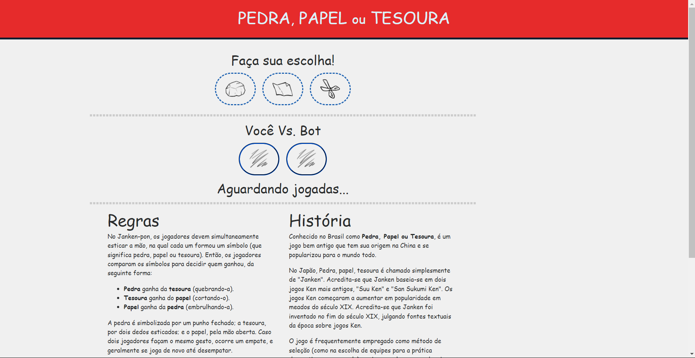
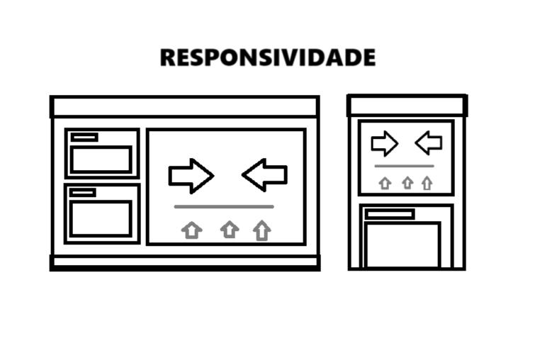

# JOGO EM JAVASCRIPT
Em 2022, a avaliação final para a matéria de Web Desing, ministrada pelo Professor Ari Barreto, foi criar um jogo funcional em Javascript juntamente de um site em HTML e Bootstrap.

Este foi meu projeto enviado.

---
Apenar de não ser dos melhores, foi de muito agrado e orgulho ao professor. Peca em responsividade, apesar de funcional.

Atualmente, com uma noção melhor de como utilizar as tecnologias citadas previamente, resolvi refazer esse site.

Seu incrível desing atual tem base nesse belo desing feito no Paint.

---

Você pode acessar 