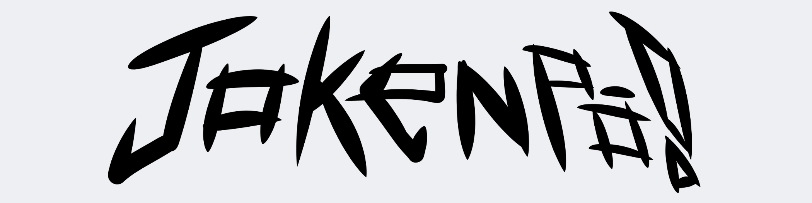
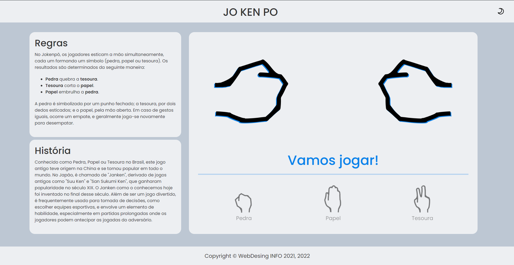

## TECNOLOGIAS UTILIZADAS
  
 
 
 

## SOBRE
Em 2022, a avaliação final da disciplina de Web Desing, ministrada pelo Professor Ari Barreto, foi criar um jogo funcional em Javascript juntamente de um site em HTML e Bootstrap.

**Projeto Original**

---
Apenar de não ser dos melhores, foi de muito agrado e orgulho ao professor. Peca em responsividade, apesar de funcional.

Atualmente, com uma noção melhor de como utilizar as tecnologias citadas anteriormente, resolvi refazer esse site. Seu incrível desing tem base nesse belo protótipo feito no Paint.

**Desing do projeto feito no Paint**

---

**Animações** e **Dark Mode**, foram adicionados para complementar o projeto.

Este foi o resultado final. Para testar, você pode acessá-lo em [**github.io/jokenpo**](https://dvanael.github.io/jokenpo/).

**Projeto Atual**

---
